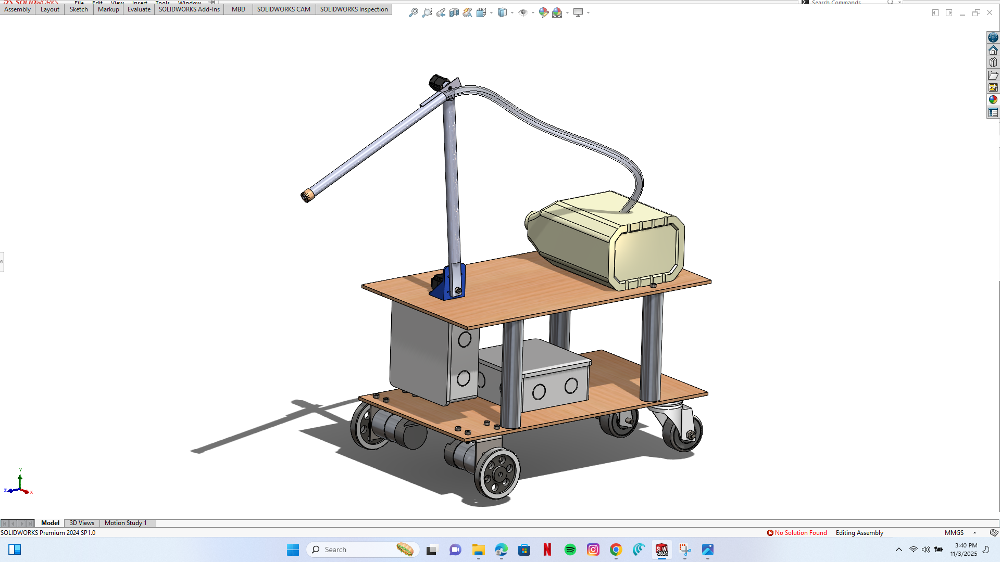
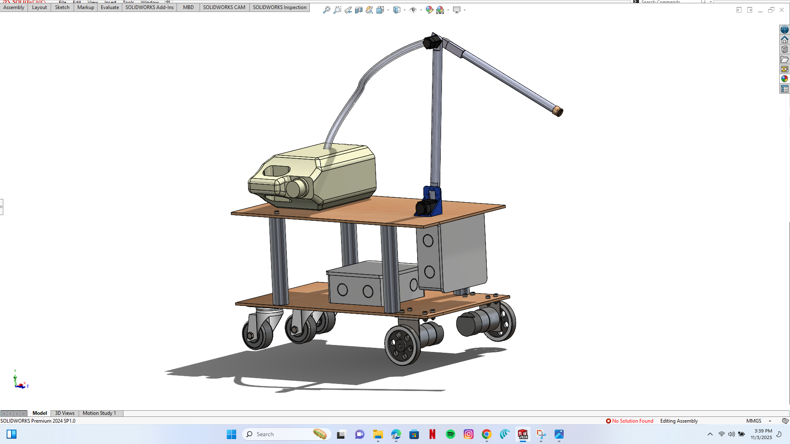

# IoT Chemical Dispensation Robot (Agribot)

A Mobile-Controlled Pesticide Spraying Robot for Nigerian Smallholder Farmers

## Banner Image


## 1. Overview

The IoT Chemical Dispensation Robot (Agribot) is a low-cost, WiFi-controlled pesticide spraying robot built specifically for Nigerian and African smallholder farmers. It improves safety by reducing direct exposure to harmful chemicals, enhances spraying efficiency through servo-controlled aiming, and provides remote operation via live video streaming.

The project integrates embedded systems, robotics, IoT, and mechanical design into an accessible and locally adaptable solution.

## 2. Problem Statement (African Context)

Smallholder farmers across Nigeria depend heavily on manual backpack spraying. This leads to:

* High pesticide inhalation risk
* Frequent skin exposure through leaks and splashes
* Long-term health effects including respiratory issues, neurological damage, and cancer
* Low PPE usage due to heat, discomfort, and cost
* Increasing insecurity in rural farming environments
* Widespread use of unregulated or banned agrochemicals

Commercial robotic spraying systems are too expensive, require high-end sensors or GPS, and are not designed for rugged rural African farms. There is a pressing need for a safe, affordable, and easy-to-maintain spraying robot for smallholder agriculture.

## 3. Solution Summary

Agribot allows farmers to spray crops from a safe distance (30–50 meters) using a WiFi-based control system. The solution was developed through a comprehensive design and prototyping process.

### 3D Design and Mechanical Development

The robot's mechanical structure was conceived and designed using **SolidWorks CAD software**, allowing for precise component placement, stress analysis, and optimization before physical construction.



*SolidWorks 3D model showing the initial design concept and component layout*

The 3D modeling phase enabled us to:
* Visualize the complete assembly and identify potential design conflicts
* Calculate optimal weight distribution for stability
* Plan cable routing and component accessibility
* Design mounting brackets for electronics and reservoir
* Simulate ground clearance and wheel positioning

### Final Physical Implementation


*The completed Agribot prototype ready for field deployment*

The final robot incorporates:
* Differential drive system with two 12V DC geared motors
* 3-liter pesticide reservoir with secure mounting
* 12V diaphragm pump with soft-start control
* MG996R high-torque pan/tilt servos for nozzle aiming
* 12V 7.2Ah battery providing 2–3 hours of runtime
* Robust chassis designed for rugged farm terrain

### Control Interface Development

A custom web-based control dashboard was built from scratch using HTML, CSS, and JavaScript, providing an intuitive interface accessible from any smartphone or tablet.


*WiFi-based control dashboard showing live video feed and control interface*

**Dashboard Features:**
* **Real-time video streaming** via ESP32-CAM for precise crop targeting
* **Directional controls** for forward, backward, left, and right movement
* **Servo angle sliders** for pan and tilt nozzle positioning (0-180°)
* **Spray control** with on/off toggle and auto-timer functionality
* **System monitoring** displaying latency, FPS, and connection status
* **Keyboard shortcuts** (arrow keys for movement, S for spray toggle)
* **No internet required** - operates on local WiFi access point

### Key Solution Components

The system is built from widely available, low-cost electronics accessible in African markets:

* **WiFi-based control dashboard** (no internet infrastructure required)
* **Real-time video streaming** for safe remote operation
* **Two-axis pan/tilt nozzle aiming** for precise application
* **Auto-timer spray mode** for consistent coverage
* **Battery-powered operation** for off-grid farms
* **30-50 meter control range** ensuring operator safety

## 4. Features

### Mechanical and Electrical

* Differential drive system with two 12V DC geared motors
* 3-liter pesticide reservoir
* 12V diaphragm pump
* MG996R high-torque pan/tilt servos
* 12V 7.2Ah battery (2–3 hours runtime)

### Control System

* ESP32-CAM for WiFi access point and video
* Arduino Nano for motors, pump, and servos
* Reliable serial communication protocol
* Soft-start / soft-stop PWM control for pump safety

### User Interface

* Custom-built control dashboard (HTML/CSS/JavaScript)
* Real-time video feed
* Direction controls
* Servo angle sliders
* Spray on/off with timer
* Latency and FPS display
* Keyboard support (arrow keys + S to toggle spray)

## 5. How It Works

### System Architecture
```
ESP32-CAM -> WiFi Access Point + Web Dashboard + Video Stream
             |
             V
Arduino Nano -> Motor Control, Servo Control, Pump Control
```

### Communication Protocol

* Motor: M[F/B/L/R/S]
* Servo: S[P/T][angle]
* Pump: P[T][1/0]
* Status/Ping: ??0

The ESP32 handles networking and the interface; the Arduino executes real-time movement and spraying.

## 6. Impact and Results

### Safety Improvements

* Keeps farmers away from chemical exposure
* Eliminates direct inhalation and skin contact
* Minimizes dependence on PPE

### Operational Improvements

* Controlled spray direction and angle
* More uniform coverage
* Live video enables precise targeting
* Works on farms without internet infrastructure

### Practicality for African Smallholders

* Affordable and easy to replicate
* Uses locally available replacement parts
* Designed for rugged, uneven rural terrain
* Repairable by local technicians

## 7. Technologies Used

**Hardware:**
ESP32-CAM, Arduino Nano, L298N motor driver, DC geared motors, MG996R servos, diaphragm pump, 12V battery.

**Software:**
Arduino IDE, FreeRTOS (ESP32 tasks), HTML/CSS/JavaScript dashboard, serial communication protocol.

**Design Tools:**
SolidWorks CAD for 3D modeling and mechanical design.

## 8. Future Improvements

* Semi-autonomous navigation
* Larger tires and stronger motors for better stability in rugged terrains (Improved traction system)
* LiDAR or ultrasonic obstacle detection
* GPS-based farm mapping
* Solar charging
* Automatic chemical mixing

## 9. Author

**Blessed Osezuwa Ariagbofo**  
Hardware/Software Product Manager | IoT Engineer  
Email: [bariagbofo@gmail.com](mailto:bariagbofo@gmail.com)  
Nigeria

## 10. License

Open-source for educational and research use.  
Commercial use requires permission.
